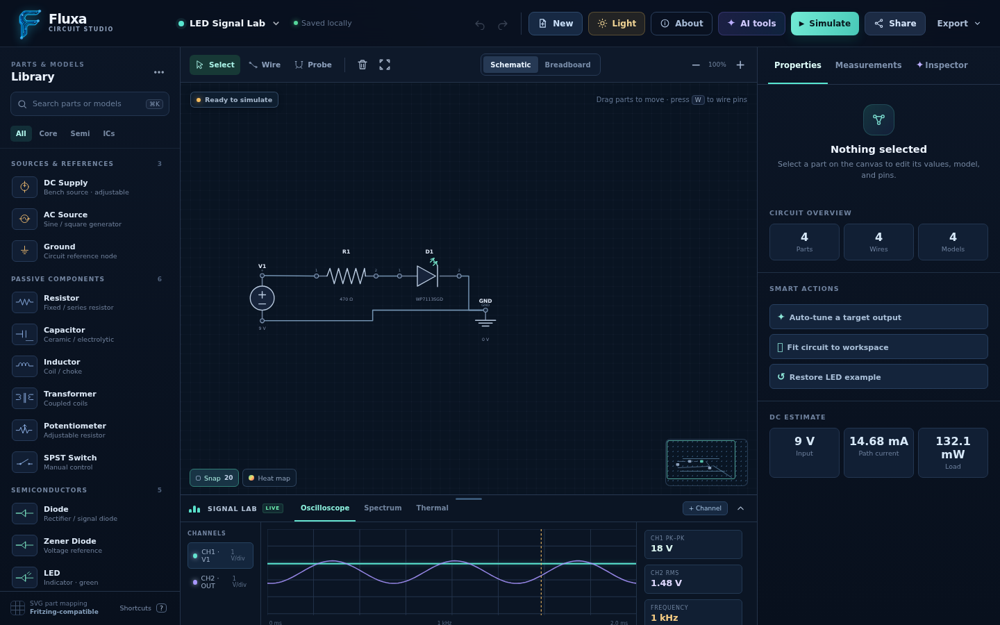
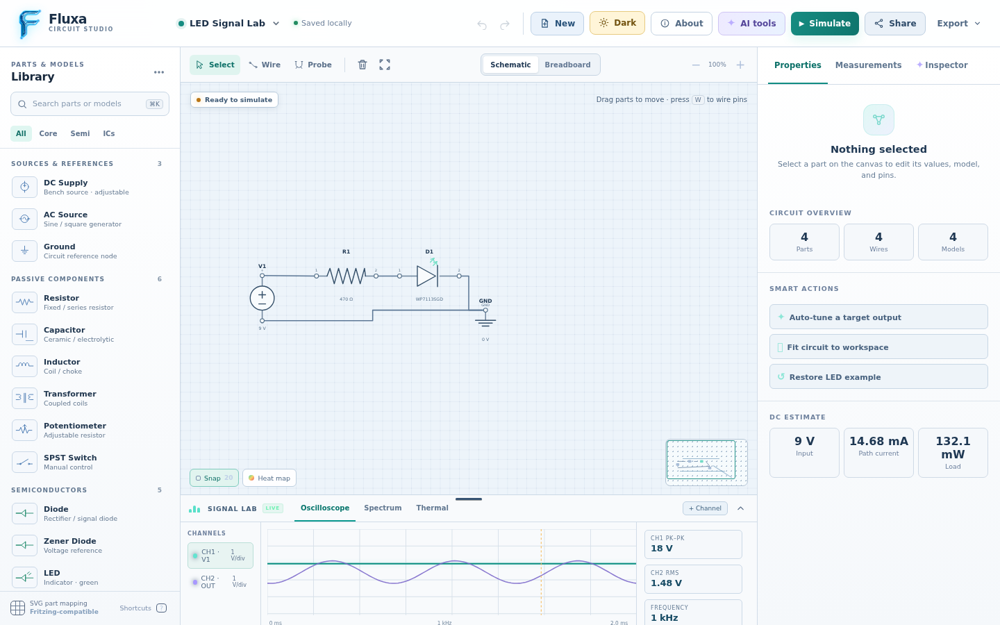

# Fluxa

**Fluxa** is a browser-based workspace for drawing, arranging and exploring simple electronic circuits.

<<<<<<< HEAD
- Version: **1.1**
- Repository: [github.com/Arvanta/Fluxa](https://github.com/Arvanta/Fluxa)

=======
>>>>>>> f46c34bbbe4bc7de36fd44eac9145240dd8d5010
<p align="center">
  
  
</p>

## What is included

- A component library with passive components, sources, ground, diodes, bridge rectifiers, LEDs, BJTs, MOSFETs, transformers, 555 timers and 741 op-amps.
- A small selectable catalog of example market models such as `2N2222`, `1N4007`, `1N4148`, `IRFZ44N`, `NE555P` and `LM741CN`.
- SVG circuit editor with drag/drop, move, snap, zoom, Undo/Redo, component rotation, duplication and deletion.
- Wiring by clicking two terminals or dragging between terminals. Existing wires can be selected, reconnected or removed.
- Schematic and Breadboard views. Breadboard view can use either a simple light background or a perforated-board background.
- Dark and light application themes.
- Seven guided Learn Mode builds: LED + resistor, voltage divider, RC filter, push-button LED, NPN switch, 555 timer and basic op-amp concepts.
- Beginner hints that highlight the next relevant library part or circuit component without locking the editor.
- Basic measurement and feedback panels: virtual meter, Quick Measure, oscilloscope-style display, spectrum display, thermal view and the Smart Circuit Inspector.
- Simulation-only visual feedback for active wires, current-direction arrows, LED brightness and optional thermal heatmap.
- Short glossary cards in Properties for common component terms and units.
- PNG and SVG output based on the active canvas view.
- Fluxa JSON export and confirmation-based JSON import.
- Local project storage, share-link generation, and a standalone `Fluxa.html` build.

## Run

### Standalone version

For normal use, no server, backend or package installation is required. Open this file directly in a modern browser:

```text
Fluxa.html
```

### Modular source version

`index.html` references separate local CSS, JavaScript and asset files. A small static server is recommended while developing or modifying the modular source:

```bash
cd fluxa
python3 -m http.server 4173 --bind 0.0.0.0
```

Then open [http://localhost:4173](http://localhost:4173).

## Basic use

1. Drag a part from **Library** onto the canvas, or click its `+` button.
2. Use the combined **Select & Wire** tool (shortcut `V` or `W`).
3. Click two terminals, or drag from one terminal to another.
4. Select a part or wire to reveal its small contextual action bar.
5. Keep **Quick Measure** enabled to show the lower-right readout; click a wire or component to inspect it. Turn **Wiring** off to click terminal nodes instead of starting wires.
6. Open **Learn** to start a guided build; Beginner hints remain optional and do not restrict the editor.
7. Use **Export** to create PNG, SVG or JSON output, or choose **Import Fluxa JSON** to reopen a saved circuit.

## Themes and views

- Use the **Light / Dark** button in the top bar to switch the application theme.
- Use **Schematic / Breadboard** in the editor toolbar to switch the circuit view.
- In Breadboard view, enable or disable **Board holes** to choose the board-style background.

## Project files

```text
fluxa/
├── index.html                     # Main modular entry point
├── styles.css                     # Application styles
├── app.js                         # Editor state, rendering and interactions
├── Fluxa.html                     # Generated standalone single-file build
├── assets/
│   ├── fluxa-logo.png             # Application logo
│   ├── social-preview.png          # GitHub social preview image
│   ├── screenshots/
│   │   ├── fluxa-schematic.png    # Dark-theme README screenshot
│   │   └── fluxa-light.png        # Light-theme Breadboard README screenshot
│   └── fritzing/                  # Selected reference SVG assets and attribution
├── vendor/
│   └── konva.min.js               # Local Konva bundle for the mini-map
└── scripts/
    └── build_standalone.py        # Rebuilds Fluxa.html
```

## Standalone build

`Fluxa.html` is a portable version with the application CSS, JavaScript, Konva bundle and logo embedded in one file.

After changing `index.html`, `styles.css`, `app.js`, the logo or Konva bundle, regenerate it with:

```bash
python3 scripts/build_standalone.py
```

## Current limitations

Fluxa currently uses a browser-side heuristic for its circuit feedback rather than a full SPICE solver. It is useful for demonstrating the editor flow and simple operating-point feedback, but it is not intended to replace a dedicated electrical simulation tool. There is no backend, authentication or real-time collaboration layer.

## Credits

Selected local reference assets under `assets/fritzing/` originate from the [Fritzing Parts Library](https://github.com/fritzing/fritzing-parts). See `assets/fritzing/ATTRIBUTION.md` for the included attribution note.
